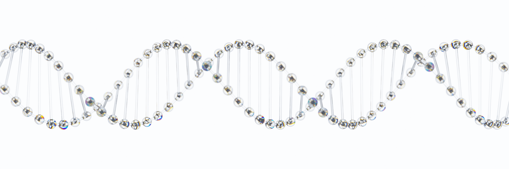

# Fastq.jl

Sequence analysis pipeline for raw DNA and cDNA reads :sparkles:

- [Use](#use)
- [Prepare environment](#prepare-environment)
- [Get Fastq.jl](#get-fastqjl)
- [Run tests](#run-tests)
- [Set settings.json](setting.md)
- [Programs called](programs.md)

## Use

Copy `Fastq.jl/setting.json` to your project directory and edit it accordingly.

```bash
cd Fastq.jl

julia --project

julia> using Fastq

# Concatenate fastq files
julia> Fastq.command.concatenate_fastq("my/project/setting.json")

# Germline DNA alignment and variant calling
julia> Fastq.command.apply_germline_dna_to_genome("my/project/setting.json")

# Somatic DNA alignment and variant calling
julia> Fastq.command.apply_somatic_dna_to_genome("my/project/setting.json")

# cDNA alignment and variant calling
julia> Fastq.command.apply_cdna_to_genome("my/project/setting.json")

# cDNA psuedoalignment and gene_x_sample creation
julia> Fastq.command.apply_cdna_to_transcriptome("my/project/setting.json")
```

## Prepare environment

_Currently works only on MacOS._

#### 1. Run

```bash
brew install fastqc kallisto samtools bcftools

pip install multiqc
```

#### 2. Download SnpEff

Download from [here](http://pcingola.github.io/SnpEff/download/) and link to `usr/local/bin`.

#### 3. Unzip programs in `Fastq.jl/tool/` and link their exectuables to `usr/local/bin/`

If programs in `tool/` fail, do this to install fastp, minimap2, and STAR.

Compile fastp from source

```bash
git clone https://github.com/OpenGene/fastp.git

cd fastp

make

sudo make install
# Follow brew install or upgrade instructions if errors arise.
```

Compile minimap2 from source

```bash
# Download source code for minimap2-2.24 from https://github.com/lh3/minimap2/releases
cd minimap2-2.24

make
```

Compile star from source

```bash
# Download STAR 2.7.9.a from https://github.com/alexdobin/STAR/releases

brew install gcc

cd STAR-2.7.9a/source

make STARforMacStatic CXX=/usr/local/Cellar/gcc/11.2.0_3/bin/g++-11

# STAR executable will be in STAR-2.7.9a/bin/MacOSX_x86_64
```

#### 4. Get Docker, manta, and strelka

[Get docker](https://docs.docker.com/get-docker/).

Download strelka-2.9.10.centos6_x86_64.tar.bz2 from [strelka releases](https://github.com/Illumina/strelka/releases).

Download manta-1.6.0.centos6_x86_64.tar.bz2 from [manta releases](https://github.com/Illumina/manta/releases).

Put manta and strelka in the same directory and unzip each. This directory is the "tool_directory" in `setting.json`.

## Get Fastq.jl

```bash
git clone https://github.com/KatharineME/Fastq.jl

cd Fastq.jl

julia --project --eval "using Pkg; Pkg.instantiate()"

```

## Run tests

Update `Fastq.jl/test/setting.json`.

```bash
julia --project --eval "using Pkg; Pkg.test()"
```

---

## :wave: :cowboy_hat_face: Howdy

To report a bug, request a feature, or leave a comment, just [submit an issue](https://github.com/GIT_USER_NAME/TEMPLATE.jl/issues/new/choose).

---

Powered by https://github.com/KwatMDPhD/PkgRepository.jl_
