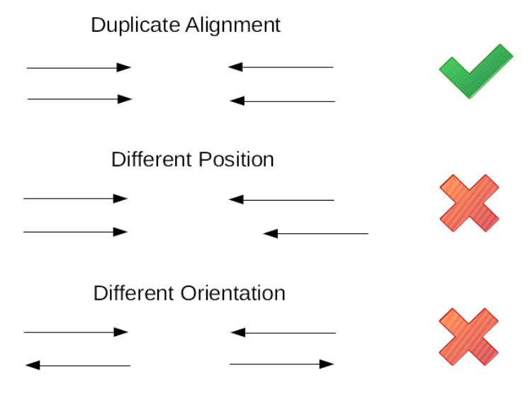
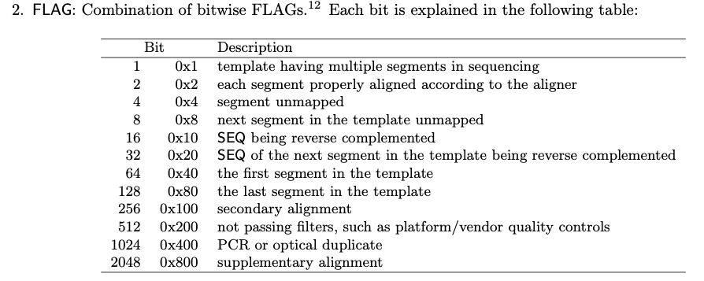

# Fastq.jl

Turns raw sequencing reads into intpretable files like: VCF for variants or a gene by sample matrix for gene expression analysis.

## Get Started on MacOS

### Prepare environment

#### 1. Run

```
git clone https://github.com/KatharineME/Fastq.jl
brew install fastqc kallisto samtools bcftools
pip install multiqc
```

#### 2. Download SnpEff

Download from [here](http://pcingola.github.io/SnpEff/download/) and link to `usr/local/bin`.

#### 3.Unzip programs in Fastq.jl/tool/ and link their exectuables to usr/local/bin/

IF programs in `tool/` fail, do this to install fastp, minimap2, and STAR.

Compile fastp from source

```sh
git clone https://github.com/OpenGene/fastp.git
cd fastp
make
sudo make install
# Follow brew install or upgrade instructions if errors arise.
```

Compile minimap2 from source

```sh
# Download source code for minimap2-2.24 from https://github.com/lh3/minimap2/releases
cd minimap2-2.24
make
```

Compile star from source

```sh
# Download STAR 2.7.9.a from https://github.com/alexdobin/STAR/releases
brew install gcc
cd STAR-2.7.9a/source
make STARforMacStatic CXX=/usr/local/Cellar/gcc/11.2.0_3/bin/g++-11
# STAR executable will be in STAR-2.7.9a/bin/MacOSX_x86_64
```

#### 4. Get Docker, manta, and strelka

[Get docker](https://docs.docker.com/get-docker/).

Download strelka-2.9.10.centos6_x86_64.tar.bz2 from [strelka releases](https://github.com/Illumina/strelka/releases).

Download manta-1.6.0.centos6_x86_64.tar.bz2 from [manta releases](https://github.com/Illumina/manta/releases).

Put manta and strelka in the same directory and unzip each.

## Trim

### fastp

Trims and preprocesses read files.

#### `detect_adapter_for_pe`

Detect the adapter sequence. This is done by default with single-end sequencing, but for paired end, you must pass this option.

#### `json`

Specify path for json report

#### `html`

Specify path for html report

## Align

### minimap2

#### `-x `

A recommended meta flag that specifies alginment chain bandwidth, elongation, discard, how many secondary alignment should be output, and more.

#### `-a`

Generates CIGAR and output alignments in SAM format.

#### `--sr`

Enable short read mode.

#### `--splice`

Enable splice alignment mode.

#### `-uf`

Use transcript strand to find canonical splice sites.

#### `-t NUM`

Number of threads.

#### `-K NUM`

Number of bases loaded into memory to process in a mini-batch [500M]. A large NUM pased here helps with load balancing in the multi-threading mode.

#### `-R`

SAM read group line in a format like @RG\\tID:foo\\tSM:bar [].

### samtools fixmate

Corrects flaws in read-pairing that the aligner may have introduced. It ensures the SAM FLAG, RNEXT, PNEXT, and TLEN fields are correct and consistent.

#### `-u`

Uncompressed output.

#### `-m`

Add mate score tag.

#### `-`

A synonym for stdin and stdout in samtools.

### samtools sort

Orders aligned reads by chromosome and coordinate. sort is highly parallel so adding threads is beneficial.

#### `-u`

Uncompressed output.

#### `-l 1`

Fastest level of BAM compressed output.

#### `-T PATH`

Specificy a temporary storage directory like `/tmp/example_prefix/`.

### samtools markdup

Marks duplicate alignments in a coordinate sorted file using flags added by `fixmate -m`. Duplicates are defined as aligned reads whose 5 prime coordinates and orientation (forward or reverse) match. For paried-end reads, both primary (not secondary alignments) read alignments must have matching 5 prime coordinates and share orientation. When a duplicate is detected the highest quality duplicate is kept and the others have the duplicate flag set.



The issue of when and whether to remove duplicates is debated. Duplicates as defined above may result from duplicate fragments made during PCR, which skew the results and should be removed. But duplicates may also be from two different fragments aligning to exact same corrdinates, in which case their sequences may differ and they should be kept. Differentiating between these two types of duplicates is the problem.

Duplicates may be removed before alignment or after. The risk with removing duplicates before alignment is that you are actually removing real signal instead of duplicate fragments. The risk with removing duplicates after alignment is that you may remove fragments with unique sequences that happen to share coordinates with another alignment.

#### `-r`

Remove reads marked with duplicate flag.

#### `--reference PATH`

Path to reference genome used for alignment.

### samtools index

Indexes a coordinate sorted bgzipped compressed SAM, BAM, or CRAM file for random access.

### samtools stats

Provides summary statistics on BAM files and outputs them in text file. Many of these statistics come from values in the FLAG column. `samtools stats` counts the number of alignments for each samtools flag type and interprets the combination of certain flags with the goal of indicating how well the alignment went. Information on each of the flags is in the [Samtools specification](https://samtools.github.io/hts-specs/SAMv1.pdf).



In the SAM or BAM file, the second colum is FLAG. Each alignment has a flag value which is a unique combination of the flags in the table above. The number 77 for example is flags 1+4+8+64. `samtools stats` deduces the independent flags and creates file wide statistics on them.

When the mapping of a read is ambiguous, it may have multiple mappings. One mapping is considered primary, and all the others have the **secondary** flag set.

When the mapping of a read is chimeric, meaning non-linear, one piece is considered representative, and the other piece(s) are given the **supplementary** flag.

## Call Variants

### Strelka

#### `--rna` (configure option)

Applies specific settings for the rna-seq variant calling use case. This option is still in development.

#### `--exome` (configure option)

Applies settings for the whole exome seqquencing use case which include disabling high depth filters.

#### `--callRegions PATH` (configure option)

Pass in a bed file with regions to check for variants in. Bed file must be gzipped and tabixed.

#### `--indelCandidates PATH` (configure option)

Pass pre-predicted indels. If running the somatic workflow, its best practice to pass manta's output `candidateSmallIndels.vcf.gz` here. If running the germline workflow, this is not recommended.

#### `--quiet` (run option)

Sends error log to `${STRELKA_ANALYSIS_PATH}/workspace/pyflow.data/logs/pyflow_log.txt` instead of stdout.

#### `--mode local`

Runs locally as opposed to running on a cluster.

### Manta

#### `--indelCandidates PATH`

### SnpEff

Annotates variant with impact (high, moderate, low, or modifier), functional consequence (early stop codon, missense mutation, synonymous mutation, etc.), potential clinical significance, and more.

### bcftools concat

Concatenate two vcfs with the same sample set.

### bcftools annotate

#### `rename-chrs PATH`

will rename the chromosmes in a vcf according to the text file passed.

## Contribution

To report a bug, request a feature, or leave a comment (about anything related to this repository), just [submit an issue](https://github.com/KatharineME/Fastq.jl.jl/issues/new/choose).

---

Made by https://github.com/KwatMDPhD/PkgRepository.jl
