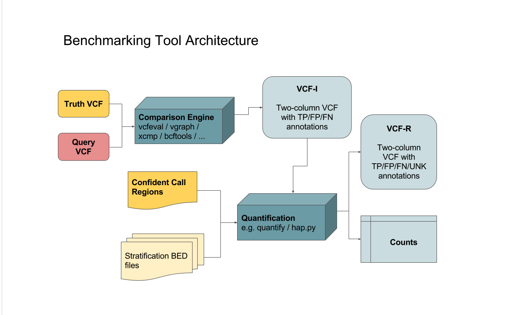
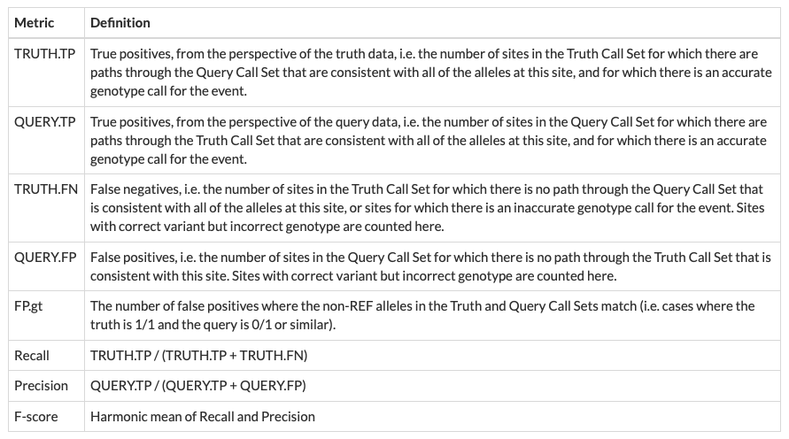

Benchmark

GiaB consortium provides truth data
Global Alliance for Genomics and Health (GA4GH) provided software and best practices for comparisons

Each entry consisted of two VCFs: one for HG001 and one for HG002. However HG002 was used to evaluate.
Challenge provided raw reads for HG001 and HG002

Version 3.2.2 of HG002 truth data was used for evaluation. There were some problems with earlier versions. The sex chromosomes do not have truth data yet, only chromosomes 1-22.

They removed offending entry VCF lines, such as lines with nan in the REF column or non-diploid genotypes (0/1/2)

## Software

Specific version of RTG’s vcfeval for VCF comparison (generates an intermediate VCF which is further quantified by hap.py)
Specific version of Illumina’s hap.py for quantification

- hap.py’s quantity tool counts and strategies variants
- specifically the HAP-207 version, with the engine set to a GA4GH-specific version of vcfeval
  Together they form the prototype GA4GH benchmarking workflow: https://github.com/ga4gh/benchmarking-tools/tree/master/doc/ref-impl



- The intermediate.vcf created by vcfeval must have two columns names: TRUTH and QUERY with these FORMAT annotations: `##FORMAT=<ID=BK,Number=1,Type=String,Description="Sub-type for decision (match/mismatch type)">`
- The stratification bed files tell hap.py which variant is what type. hapy.py uses that information to give performance metrics in each variant type category
  - The new stratification bed files according to ga4gh: https://github.com/genome-in-a-bottle/genome-stratifications
- How you would call hap.py to evaluate a query.vcf

wget ftp://ftp-trace.ncbi.nlm.nih.gov/ReferenceSamples/giab/data/AshkenazimTrio/analysis/NIST_v4.1_SmallVariantDraftBenchmark_12182019/GRCh37/HG002_GRCh37_1_22_v4.1_draft_benchmark.vcf.gz
wget ftp://ftp-trace.ncbi.nlm.nih.gov/ReferenceSamples/giab/data/AshkenazimTrio/analysis/NIST_v4.1_SmallVariantDraftBenchmark_12182019/GRCh37/HG002_GRCh37_1_22_v4.1_draft_benchmark.vcf.gz.tbi
wget ftp://ftp-trace.ncbi.nlm.nih.gov/ReferenceSamples/giab/data/AshkenazimTrio/analysis/NIST_v4.1_SmallVariantDraftBenchmark_12182019/GRCh37/HG002_GRCh37_1_22_v4.1_draft_benchmark.bed

hap.py HG002_GRCh37_1_22_v4.1_draft_benchmark.vcf.gz query.vcf.gz -f HG002_GRCh37_1_22_v4.1_draft_benchmark.bed -o benchmarking-output

Vcfeval

- Before running need to convert reference faster to sdf format like this:
  `rtg format -o hg19.sdf hg19.fa` - that command creates a folder hg38.sdf which must be passed to hap.py `--engine-vcfeval-template hg38.sdf`

Hap.py -https://github.com/Illumina/hap.py

- This is command to use with the exception that rtg wasn’t installed via hap.py:
  `hap.py truth.vcf.gz query.vcf.gz -f conf.bed.gz -o ./test -V --engine-vcfeval-path /path/to/rtg --engine-vcfeval-template /path/to/hg38.sdf` - `-f` is for passing a bed file of confident call regions, hap.py will be able to say that variant calls different from these are false positives - `-o` specifies an output file prefix - `-V` writes an annotated VCF - `--engine-vcfeval-path` specifies path to rtg installation - `--engine-vcfeval-template` specifies path to SDF used for vcfeval run

## Metrics

Highest SNP performance - highest SNP F-score
Highest SNP recall
Highest SNP precision
Highest Indel performance - highest Indel F-score
Highest Indel recall
Highest Indel precision

- True Positive / TP: present in both truth and query
- False Positive / FP: present only in the query
- False Negative / FN: present only in the truth
- Not-assessed / N: call was not assigned a match status

## Data

HG002 raw data came from: https://ftp-trace.ncbi.nlm.nih.gov/ReferenceSamples/giab/data/AshkenazimTrio/HG002_NA24385_son/NIST_HiSeq_HG002_Homogeneity-10953946/HG002_HiSeq300x_fastq/ referenced from https://github.com/genome-in-a-bottle/giab_data_indexes

The folders under “HG002_HiSeq300x_fastq” each contain 20-30X sequencing (a single flow cell) and contain folders with fast files from each library, which can be combined for most purposes. Samples A-L are the six vials of starting material. Each sample has two technical replicates, hence Sample A1 and Sample A2.

HG002 Truth VCF data came from: https://ftp-trace.ncbi.nlm.nih.gov/giab/ftp/release/AshkenazimTrio/HG002_NA24385_son/NISTv4.2.1/GRCh38/
