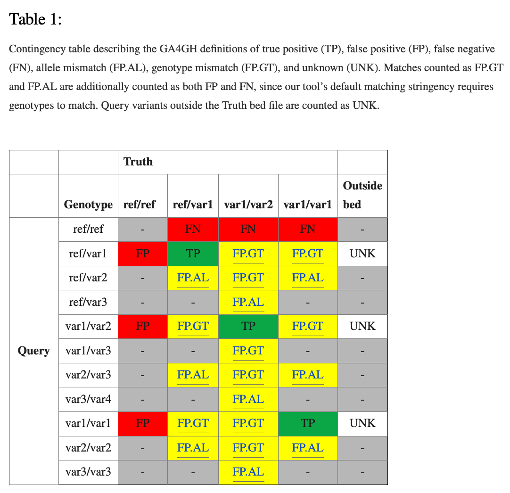

# Benchmark

Fastq.jl has been benchmarked in the same fashion as entries into the [2016 PrecisionFDA Truth Challenge](https://precision.fda.gov/challenges/truth/results) and is therefore comparable to those entries.

The [2020 PrecisionFDA Truth Challenge V2](https://precision.fda.gov/challenges/10) was focused on difficult-to-map regions of GRCH38 including segmental duplications and MHC regions. In the future Fastq.jl will be benchmarked according to this challenge as well.

## PrecisionFDA Truth Challenge Overview

- Sequence analysis pipeline challenge where entires were competing on SNP and Indel recall, performance, and precision
- There were 35 entries
- Each challenge entry consisted of two VCFs: one for HG001 and one for HG002
- However only HG002 was used to evaluate the entries and choose the winners
- Genome in a Bottle (GiaB) consortium provided the truth data
- Global Alliance for Genomics and Health (GA4GH) provided software and best practices for comparisons
- [G4AGH's 2019 paper](https://www.ncbi.nlm.nih.gov/pmc/articles/PMC6699627/#SD1) represents the latest standards for benchmarking
- Version 3.2.2 of HG002 truth data was used for evaluation
- The sex chromosomes did not have truth data, only chromosomes 1-22
- When evaluating entries they removed offending VCF lines, such as lines with "nan" in the REF column or non-diploid genotypes (0/1/2)
- Participants were asked to use their pipelines with 50x Illumina WGS to predict variants from at the time yet unknown reference sample HG0002/NA24385

## Data Sources

[HG002 raw data](https://ftp-trace.ncbi.nlm.nih.gov/ReferenceSamples/giab/data/AshkenazimTrio/HG002_NA24385_son/NIST_HiSeq_HG002_Homogeneity-10953946/HG002_HiSeq300x_fastq/) referenced from [here](https://github.com/genome-in-a-bottle/giab_data_indexes)

The folders under “HG002_HiSeq300x_fastq” each contain 20-30X sequencing (a single flow cell) and contain folders with fast files from each library, which can be combined for most purposes. Samples A-L are the six vials of starting material. Each sample has two technical replicates, hence Sample A1 and Sample A2.

[HG002 Truth VCF and BED](https://ftp-trace.ncbi.nlm.nih.gov/giab/ftp/release/AshkenazimTrio/HG002_NA24385_son/NISTv4.2.1/GRCh38/)

## Software

In the PrecisionFDA Truth Challenge, GA4GH was responsible for defining best practices and software specifications. GA4GH created a prototype [benchmark workflow](https://github.com/ga4gh/benchmarking-tools/tree/master/doc/ref-impl) that consisted of specific implementations of RTG's vcfeval and Illumina's hap.py. RTG’s vcfeval was used for VCF comparison. vcfeval generated an intermediate VCF which was further quantified by hap.py.

However the hap.py function that accepted an intermediate VCF from vcfeval is no longer available. Fortunately hap.py allows for the VCF comparison engine to be set to a desired version of vcfeval. This is the method we used to benchmark Fastq.jl. We run hap.py using vcfeval's VCF comparision engine and get back precision and recall metrics stratified by variant type.

### vcfeval

- https://github.com/RealTimeGenomics/rtg-tools
- Before running vcfeval (or hap.py using vcfeval as engine) need to convert reference faster to sdf format like this:
  `rtg format -o hg19.sdf hg19.fa`. That command creates a folder hg38.sdf which must be passed to hap.py `--engine-vcfeval-template hg38.sdf`

### hap.py

- https://github.com/Illumina/hap.py
- Includes a comparison tool to perform haplotype-based comparison of complex variants in addition to sophisticated functionality to stratify variant calls by type or region
- Stratification bed files tell hap.py which variant is what type. hapy.py uses that information to give performance metrics in each variant type category
- The new stratification bed files according to ga4gh: https://github.com/genome-in-a-bottle/genome-stratifications

- `-f BED` is for passing a bed file of confident call regions, hap.py will be able to say that variant calls different from these are false positives
- `--stratification TSV` for passing a TSV where first column in region name and second column is stratification bed file path
- `-o PREFIX` specifies an output file prefix
- `-V` writes an annotated VCF
- `--engine-vcfeval-path PATH` specifies path to rtg installation
- `--engine-vcfeval-template PATH` specifies path to SDF used for vcfeval run

## Metrics

PrecisionFDA Truth Challenge Metics

- Highest SNP performance - highest SNP F-score
- Highest SNP recall
- Highest SNP precision
- Highest Indel performance - highest Indel F-score
- Highest Indel recall
- Highest Indel precision

Notes from the 2019 benchmarking paper

- The ability to detect variants that are known to be present or “absence of false negatives”, which we call “recall” in this work
- Specificity (the ability to correctly identify the absence of variants or “absence of false positives”, which we replace with “precision” in this work
- Precision is often a more useful metric than specificity due to the very large proportion of true negative positions in the genome
- Our tools calculate TP, FP, and FN requiring the genotype to match, but output additional statistics related to how many of the FPs and FNs are allele matches (FP.GT) or local matches (FP.AL)
- Note that we have chosen not to include true negatives (or consequently specificity) in our standardized definitions. This is due to the challenge in defining the number of true negatives, particularly for indels or around complex variants.

- True Positive / TP: present in both truth and query
- False Positive / FP: present only in the query
- False Negative / FN: present only in the truth
- Not-assessed / N: call was not assigned a match status
